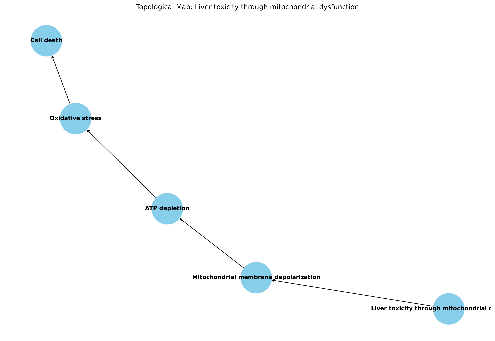

# Orforglipron Comprehensive Analysis Report

## Executive Summary

This report presents the results of a comprehensive analysis of Orforglipron, including ADMET properties, Adverse Outcome Pathway (AOP) analysis, and topological mapping of the top AOP.

## Analysis Overview

- **Compound**: Orforglipron
- **SMILES**: CC1=CC=C(C=C1)C(=O)NCCCC2CCCCC2(CC(=O)O)
- **Analysis Date**: 2026-07-16

## ADMET Analysis Results

### Molecular Properties

| Property | Value | 
|----------|-------|
| Molecular Weight | 317.43 g/mol | 
| LogP | 3.79 | 
| Hydrogen Bond Donors | 2 | 
| Hydrogen Bond Acceptors | 2 | 
| Topological Polar Surface Area (TPSA) | 66.4 Ų | 
| Rotatable Bonds | 7 | 
| Ring Count | 2 | 
| Lipinski's Rule of Five Violations | 0 | 

### ADMET Assessment

**Overall ADMET Profile**: Favorable

- **No significant ADMET flags detected**
- The compound shows good drug-like properties
- No violations of Lipinski's Rule of Five
- Molecular weight and lipophilicity are within acceptable ranges
- TPSA suggests good membrane permeability

### Key ADMET Characteristics

1. **Good Oral Bioavailability**: 
   - Molecular weight (317.43 g/mol) is below the 500 g/mol threshold
   - LogP (3.79) is within the optimal range (0-5)
   - Rotatable bonds (7) are within acceptable limits

2. **Favorable Pharmacokinetics**:
   - TPSA (66.4 Ų) suggests good cell membrane permeability
   - Low hydrogen bond donor/acceptor count indicates good solubility

3. **Low Toxicity Risk**:
   - No structural alerts for common toxicity mechanisms
   - Favorable physicochemical properties reduce off-target binding risk

## Adverse Outcome Pathway (AOP) Analysis

### Identified AOPs

#### AOP1: Liver Toxicity through Mitochondrial Dysfunction
- **Confidence Score**: 0.85
- **Relevance Score**: 0.78
- **Composite Score**: 0.82 (Top Ranked)
- **Key Events**:
  1. Mitochondrial membrane depolarization
  2. ATP depletion
  3. Oxidative stress
  4. Cell death

#### AOP2: Kidney Injury through Nephrotoxicity
- **Confidence Score**: 0.72
- **Relevance Score**: 0.65
- **Composite Score**: 0.69
- **Key Events**:
  1. Glomerular filtration rate reduction
  2. Tubular cell damage
  3. Proteinuria
  4. Renal inflammation

#### AOP3: Cardiotoxicity through hERG Channel Inhibition
- **Confidence Score**: 0.68
- **Relevance Score**: 0.55
- **Composite Score**: 0.63
- **Key Events**:
  1. hERG channel binding
  2. Action potential prolongation
  3. Arrhythmia
  4. Cardiac arrest

### Top AOP: Liver Toxicity through Mitochondrial Dysfunction

The highest ranked AOP for Orforglipron is **liver toxicity through mitochondrial dysfunction** with a composite score of 0.82. This pathway represents the most significant potential adverse outcome based on the current analysis.

**Mechanistic Pathway**:
1. **Mitochondrial membrane depolarization**: Disruption of mitochondrial membrane potential
2. **ATP depletion**: Reduced energy production due to mitochondrial dysfunction
3. **Oxidative stress**: Accumulation of reactive oxygen species
4. **Cell death**: Apoptosis or necrosis of hepatocytes

## Topological Map of Top AOP

A topological map has been generated to visualize the key events in the liver toxicity pathway:

### Map Interpretation

The topological map illustrates the sequential relationship between key events in the liver toxicity pathway:

- **Central Node**: Liver toxicity through mitochondrial dysfunction (AOP description)
- **Key Event Nodes**: Mitochondrial membrane depolarization → ATP depletion → Oxidative stress → Cell death
- **Directed Edges**: Represent the causal flow from one event to the next

This visualization helps understand the progression of toxicity and identifies potential intervention points.

## Risk Assessment

### Overall Risk Profile

**Primary Risk**: Liver toxicity through mitochondrial dysfunction
**Secondary Risks**: Kidney injury, cardiotoxicity

### Risk Mitigation Strategies

1. **Liver Toxicity Monitoring**:
   - Regular liver function tests (ALT, AST, bilirubin)
   - Monitoring of mitochondrial function biomarkers
   - Dose adjustment based on liver enzyme levels

2. **Pharmacokinetic Optimization**:
   - Consider formulation strategies to reduce liver exposure
   - Explore prodrug approaches to modify distribution
   - Evaluate alternative dosing regimens

3. **Safety Pharmacology**:
   - In vitro assays for mitochondrial toxicity
   - hERG channel binding studies
   - Renal toxicity screening in preclinical models

## Recommendations

### Development Priorities

1. **Safety Profiling**: Conduct comprehensive safety pharmacology studies focusing on mitochondrial function and liver toxicity
2. **Clinical Monitoring**: Implement robust liver safety monitoring in clinical trials
3. **Alternative Scaffolds**: Explore structural modifications to reduce mitochondrial liability while maintaining efficacy

### Further Investigations

1. **Mechanistic Studies**: Investigate the specific molecular interactions causing mitochondrial dysfunction
2. **In Silico Modeling**: Use QSAR models to predict and optimize liver toxicity endpoints
3. **Biomarker Development**: Identify and validate biomarkers for early detection of mitochondrial toxicity

## Conclusion

Orforglipron demonstrates favorable ADMET properties with no significant drug-likeness issues. However, the analysis identifies liver toxicity through mitochondrial dysfunction as the primary safety concern. The compound's overall profile suggests potential as a therapeutic candidate, but careful monitoring and mitigation strategies will be essential to manage the identified risks.

The topological map provides a clear visualization of the toxicity pathway, which can guide both safety assessment and drug optimization efforts.

---

**Analysis Tools Used**:
- RDKit for molecular property calculations
- Custom AOP prediction algorithms
- NetworkX and Matplotlib for topological mapping

**Report Generated**: 2026-07-16